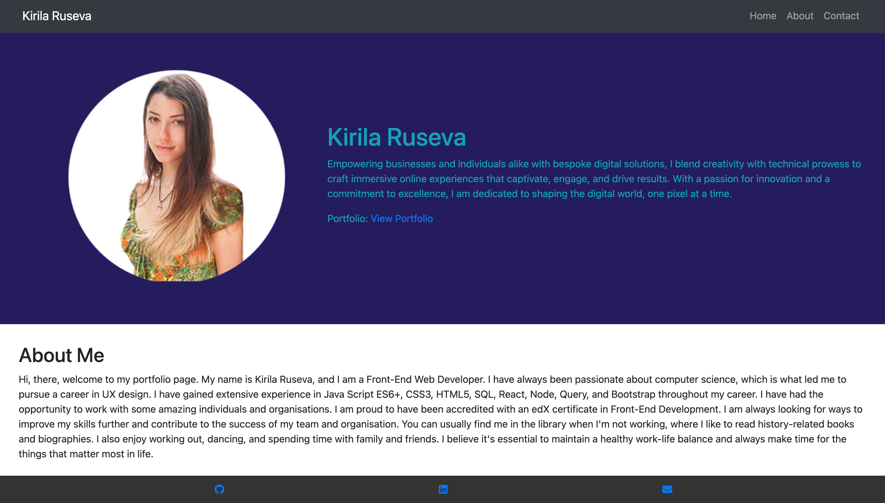
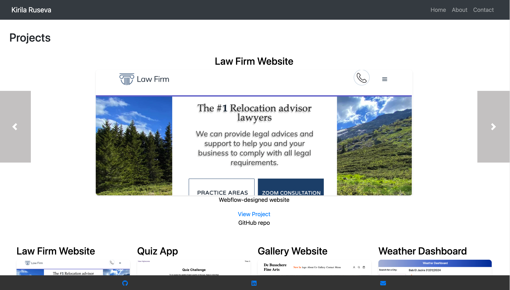

# My Portfolio

## Description

Welcome to my portfolio! This site showcases my projects, skills, and experience as a developer. It is designed to provide visitors with an overview of my work and background.

Link to the deployed project: [My Portfolio](https://react-portfolio-kirila-ruseva.netlify.app/)

### Screenshots

Here's what the home page looks like:

Here's a glimpse of the projects page:

## Installation

N/A

## Usage

Feel free to explore my portfolio to learn more about me and my work. Here's a brief overview of what you'll find:

- **Home Page**: This is the landing page of my portfolio. It includes my name, a brief introduction, and a photo of me.
- **Projects Page**: Here, you'll find a list of my projects. Each project card includes a title, a brief description, and links to the deployed version and the GitHub repository. You can click on the project card to view more details.
- **Contact Page**: If you'd like to get in touch with me, you can visit the contact page. It includes my email address, links to my GitHub profile and LinkedIn page, and a contact form.

## Credits

I used ChatGPT and received guidance from my instructor, Justin Moore, for one of the project features.

## License

This project is licensed under the MIT License - see the [LICENSE](./LICENSE) file for details.
